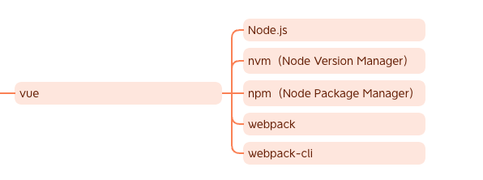
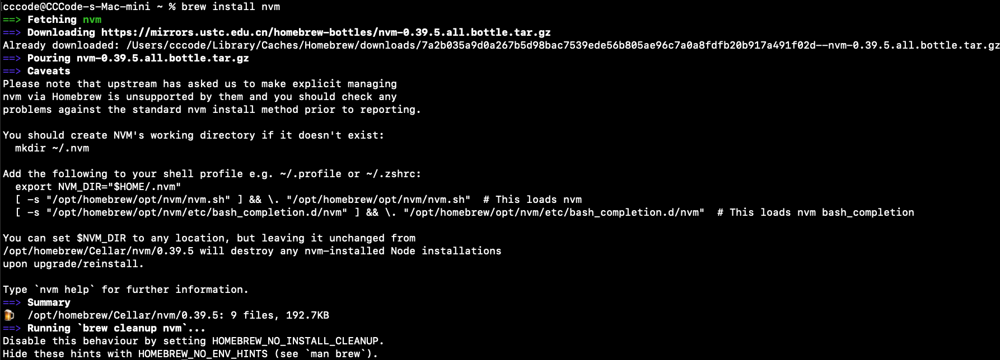
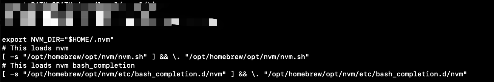
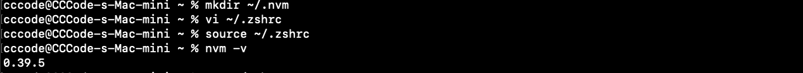
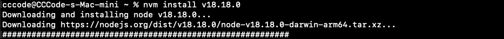
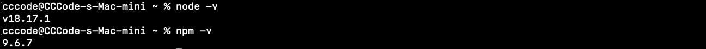
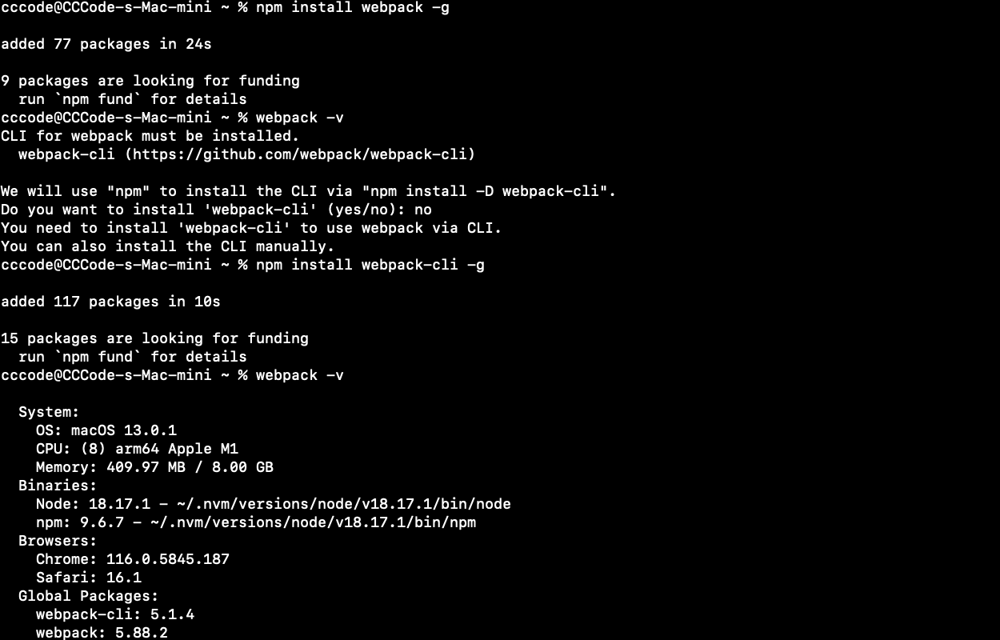
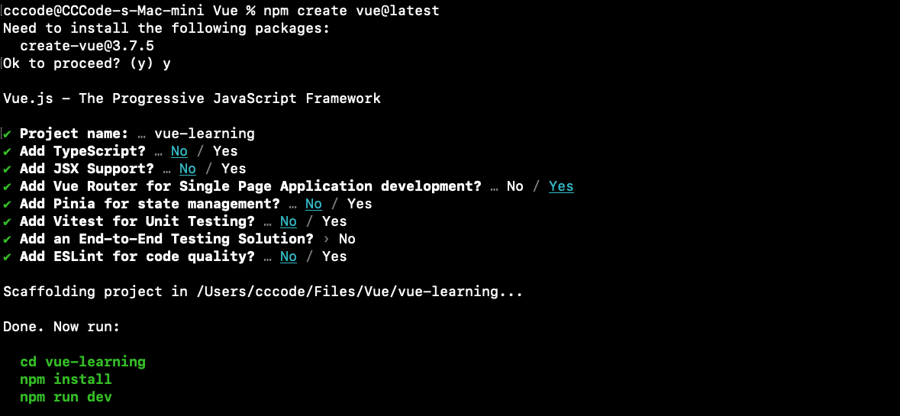

### 思维导图



#### 一、安装Node.js

[Node.js](https://nodejs.org/en/about)是一套开源的跨平台JavaScript运行时环境，可以使得JavaScript脱离浏览器在本地运行。

[NVM](https://github.com/nvm-sh/nvm)（Node Version Manager）是一个用于管理Node.js版本的工具。通过它可以在设备上轻松切换不同版本的Node.js。

[NPM](https://docs.npmjs.com/about-npm)（Node Package Manager）是Node.js默认的软件包管理系统。

1. ##### 使用homebrew安装nvm。

```sh
brew install nvm
```



2. ##### 根据命令行输出提示创建nvm工作目录，并添加指定命令至终端配置文件。

```sh
# 创建nvm工作目录
mkdir ~/.nvm

# 编辑终端配置文件
vi ~/.zshrc

export NVM_DIR="$HOME/.nvm"
# This loads nvm
[ -s "/opt/homebrew/opt/nvm/nvm.sh" ] && \. "/opt/homebrew/opt/nvm/nvm.sh"
# This loads nvm bash_completion
[ -s "/opt/homebrew/opt/nvm/etc/bash_completion.d/nvm" ] && \. "/opt/homebrew/opt/nvm/etc/bash_completion.d/nvm"
```



```sh
# 刷新配置文件使配置生效
source ~/.zshrc
# 查看nvm版本（输出版本号则表示安装成功）
nvm -v
```



3. ##### 安装Node。

```
# 查看所有可安装的node版本
nvm ls-remote
# 安装最新的长期支持版本（建议）
nvm install v18.17.1
# 安装完成后，指定使用该版本node
nvm use v18.17.1
# 并将该版本指定为默认版本，每次启动终端都使用该版本node
nvm alias default v18.17.1
```



```sh
# 查看Node版本
node -v
# 查看npm版本
npm -v
```



#### 二、安装Webpack

[webpack](https://github.com/webpack/webpack) 是一个JavaScript应用的静态模块化打包工具。

[webpack-cli ](https://github.com/webpack/webpack-cli)是一个命令行工具，允许我们运行webpack打包命令、初始化webpack配置文件等。

```
# 使用npm安装webpack（-g 表示全局安装）
npm install webpack -g
# 使用npm安装webpack-cli（webpack4开始从webpack中分离，需单独安装）
npm install webpack-cli -g
```



#### 三、快速上手

接下开就可以根据vue官网的指引 [快速创建一个vue应用](https://cn.vuejs.org/guide/quick-start.html) 了



